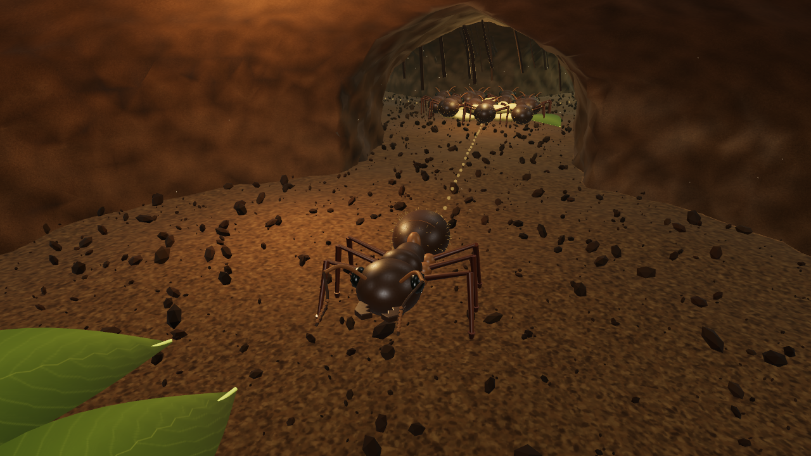

# Ant Life RPG

A worker's life inside a living terrarium. Built with Three.js WebGPU, with automatic WebGL 2 fallback. Development is ongoing; the full vision is in [docs/vision.md](docs/vision.md).

## Run

Node 22 or newer. `npm ci`, then `npm run dev`. `npm run build` creates a static GitHub Pages compatible bundle. `npm test` verifies simulation invariants; `npm run lint` checks source.

## Development approach

Build and visually inspect a small connected colony before scaling up. Physical soil removal must produce conserved loose material. NPC identities and memories belong to the simulation, independently of their rendered bodies. Rendering quality and frame rates must be evaluated in actual gameplay.

The GitHub Actions workflow verifies every pull request and deploys main to Pages. Source assets and reproducible Blender scripts belong in this repository.

## Status

The current prototype is playable at **https://samg-coder.github.io/AntLifeRPG/**.

- WASD moves, Shift runs, drag looks, mouse wheel adjusts follow distance.
- F switches first/third person. Q scrapes the excavation face; E lifts, drops, deposits, eats or greets according to proximity.
- C engages nest-surface grip. While gripping, W/S advance/reverse, A/D turn, and V toggles steady advance. Return to level ground and press C to release before other interactions.
- H opens field notes and scent routes. Following a scent moves physically through the connected tunnels; WASD cancels guidance.
- R rests at the home leaf bed. Browser IndexedDB stores the colony every 20 seconds and when the page becomes hidden.

There are 24 named workers, a home, food store, excavation face, spoil bed and surface garden. Soil removal changes actual mesh geometry and produces persistent movable items. Workers now share the same item and excavation state as the player. Initial relationships record greetings and shared work.

The player can traverse nest-soil walls and ceilings with an oriented camera and saved attachment state. Grip currently excludes roots, rocks and foliage; workers still follow ground routes. Tight transitions and excavation clearance need further refinement.

This is an early prototype, not the finished vertical slice or the final graphical quality target. Universal climbing, full soil stability, mature schedules/relationships, cooperative hauling, leisure, home furnishing, quality presets and broad performance validation are still outstanding. See [the critical iteration log](docs/iteration-log.md).

Actual gameplay renderer capture, with HTML HUD omitted; no retouching or generated imagery:



## Editable assets

`assets/worker-ant.blend` is the source model. Rebuild it and the glTF with:

```powershell
& 'D:/Blender/blender.exe' -b -t 4 --python scripts/build_ant.py
```

The anatomical body is authored in Blender; runtime limbs use contact-driven animation in `src/ant.js`. Browser shaders add fine cuticle variation. Material and geometry quality remain under active refinement.
